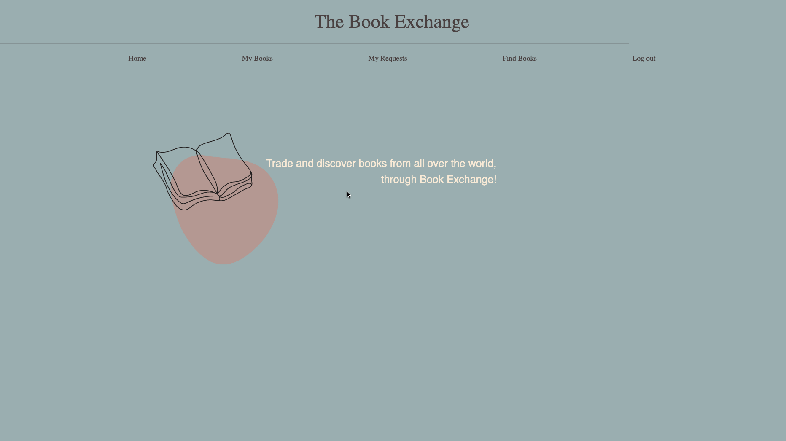
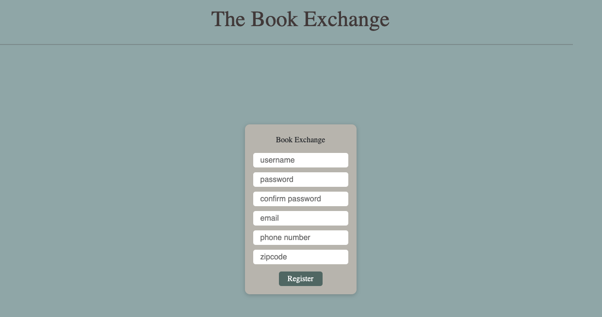
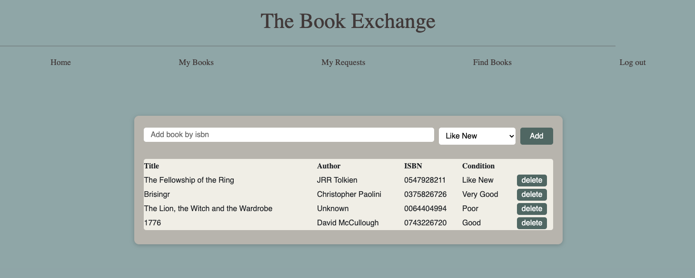

<h1 align="center">
  <br>
    
    <br>
    <br>
  The Book Exchange
    <br>
  <br>
</h1>

<p align="center">

</p>

## Description
<h4><strong>The Book Exchange is a one stop book trading platform, allowing users to not only search for their favorite books by ISBN, but also intereact with other users to trade books with each other.</strong></h4>

## Features

### Login & Register Functionality


<p align="center">

</p>

### Add Favorite Books By ISBN


<p align="center">

</p>

## Getting Started

### Install dependencies
```bash
npm install
```

### Run in development
```bash
npm run dev
```

### Start an instance
```bash
npm start
```


